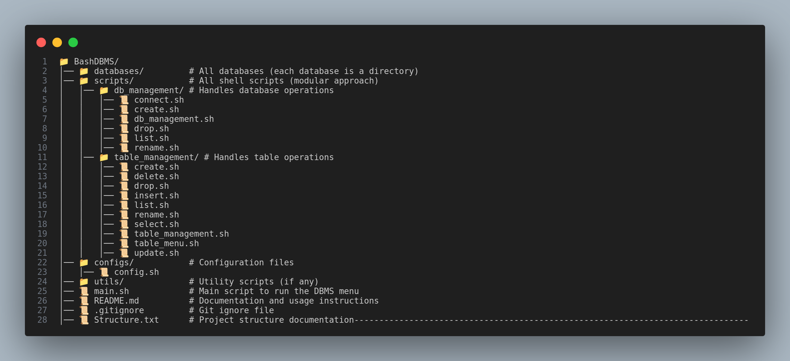

# Bash Script Database Project

This project is a simple database management system implemented using Bash scripts. It allows users to create, manage, and interact with databases and tables directly from the command line.

## Features

- Create and delete databases
- Create, delete, and modify tables within databases
- Insert, update, and delete records in tables
- Query and display data from tables

## Prerequisites

To run this project, you need to have the following installed on your system:

- Bash (version 4.0 or higher)
- Basic Unix/Linux command-line tools

## Installation

1. Clone the repository to your local machine:

   ```bash
   git clone https://github.com/MohamedHaro0on/bash-script-database-project.git
   ```

## Usage

To start using the database management system, run the main script in sudo privilege:

```sudo ./main.sh
```

## Project Structure



## Metadata File

id:integer:PK,name:string,age:date,salary:float

## Environment Variables

The application declares the following environment variables:

- **Global Paths**

  - `export ACTIVE_DB_PATH=""`
  - `export DBS_PATH="./databases"`

- **Global Variables**
  - `export DB_NAME=""`
  - `# export CURRENT_TABLE=""`

## Database Management

- **Create a Database**: Specify a name for the new database.
- **List Databases**: Display a list of all existing databases.
- **Drop a Database**: Select an existing database to delete.
- **Connect to a Database**: Choose a database to work with.
- **Rename a Database**: Change the name of an existing database.

## Table Management

- **Create a Table**: Specify the table name and define its columns. You will be prompted to enter the column names and data types.
- **List Tables**: Display a list of all tables within the connected database.
- **Drop a Table**: Choose a table from the selected database to delete.
- **Rename a Table**: Change the name of an existing table.
- **Insert Into Table**: Add new records to a table by providing values for each column.
- **Delete From Table**: Remove records from a table based on specified conditions.
- **Select with Filters**: Retrieve and display data from a table based on specified criteria.

## Data Management

- **Insert Data**: Add new records to a table by providing values for each column.
- **Update Data**: Modify existing records in a table by specifying the criteria and new values.
- **Delete Data**: Remove records from a table based on specified conditions.
- **Query Data**: Retrieve and display data from a table based on specified criteria.

## Contributing

Contributions are welcome! If you have suggestions for improvements or new features, feel free to open an issue or submit a pull request.

## License

This project is licensed under the MIT License. See the LICENSE file for more details.
